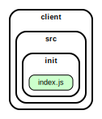

<!-- BEGIN TITLE -->

# DOCS

<!-- END TITLE -->

<!-- BEGIN TREE -->

> [interactive graph](./dependency-graph.html)

<!-- END TREE -->

<!-- BEGIN TOC -->

- public
- src
  - components
  - handlers
  - init
    - [index.js](#clientsrcinitindexjs)
  - listeners
  - logic
- styles
- [data.js](#clientdatajs)

---

<!-- END TOC -->

<!-- BEGIN DOCS -->

# /public

---

# /src

## /components

---

## /handlers

---

## /init

<a href="../../client/src/init/index.js" id="clientsrcinitindexjs">../client/src/init/index.js</a>

---

## /listeners

---

## /logic

---

---

# /styles

---

<a href="../../client/data.js" id="clientdatajs">../client/data.js</a>

<!-- END DOCS -->
